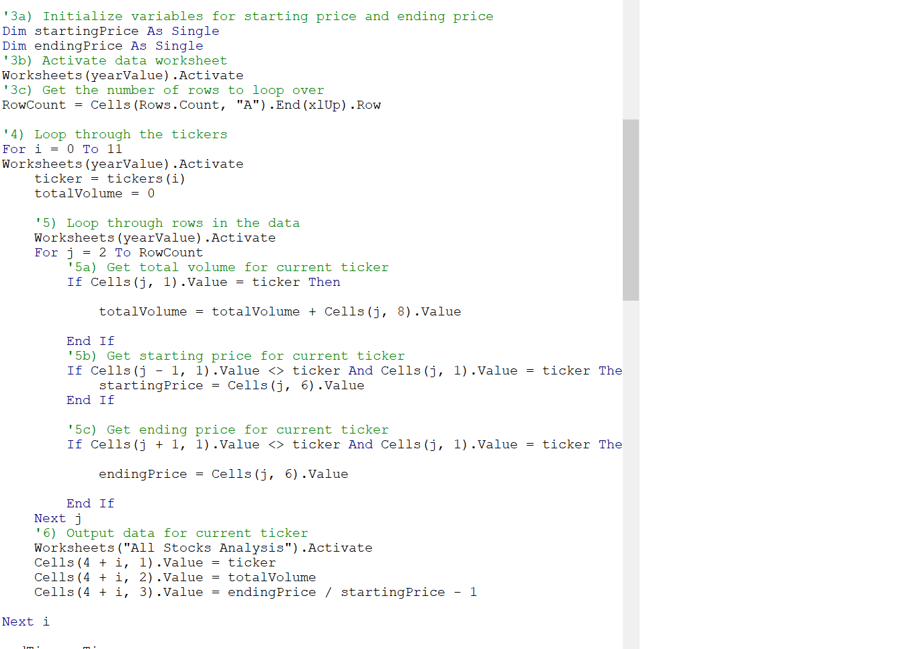

# Stock-Analysis
## Overview of Project
### Purpose
* This macro provides stock analysis with just the click of a button. Once the button is clicked, the VBA script loops through all of the stock data for the selected year and     displays each stock's respective total volume, and return (written as a percent change). Further, the macro is programmed to format all positive returns in green, and all       negative returns in red, allowing the end-user to process the macro's analysis more efficiently through visual representation.
* In addition, my refactoring skills were put to work when I decided to refactor my original code with the goal of decreasing the overall run time of the macro.
---
## Results
### 2017 All Stocks Analysis Run Time Results
* The end results displayed the refactored code, running the macro for the "2017" sheet, to be 2.515625 seconds faster than the original code, as shown by the images below:

---
### 2018 All Stocks Analysis Run Time Results
* The end results displayed the refactored code, running the macro for the "2018" sheet, to be 2.1171875 seconds faster than the original code, as shown by the images below:

---
## Summary 
### Advantages and Disadvantages of Original/Refactored VBA Script
## Original
1. An advantage of the original script is that it would be easier for someone else (who did not write the original code) to understand at first glance. To elaborate, I think that since the original code is not refactored, the individual tasks within the code are more spread out and in my opinion, it would takes less thought-processing time to comprehend many isolated statements than multiple combined statements (again, from the perspective of someone who did not write the original code) because multiple isolated statements allow the viewer to actually see the coder's thought process by viewing the first draft of his/her work. Whereas, when the code has been refactored, the person viewing the code for the first time will likely have to reverse engineer the script to understand exactly how it works.
2. A disadvanatge of the original script is clearly its lacking of efficiencies that are created through refactoring. Although the original script may be easier to comprehend, the refactored script is superior in and of itself because of the synergies realized upon refactoring. For example, the original script had a nested for loop, while the refactored script did not. The refactored script had one primary for loop used to acquire all of our desired information. Moreover, since a nested for loop is exponential in nature, it makes sense why the refactored code runs faster than the original. The following is a picture of the original code with the nested for loop:

## Refactored
1. One advantage of the refactored code is that it combines the formatting macro and stock analysis macro into one macro, thereby, only one button needs to be clicked from the front-end to run the entire macro. 
2. In addition, the refactored script does not use a nested for loop, but rather uses one primary for loop to obtain all the desired stock data. It does this by making use of two other for loops that act in sequence to help the primary for loop execute its desired functions successfully. Additionally, the refactored code makes use of a "tickerindex" variable that helps the different arrays within the primary for loop keep track of the current ticker being iterated. The following is a picture of the refactored code:

